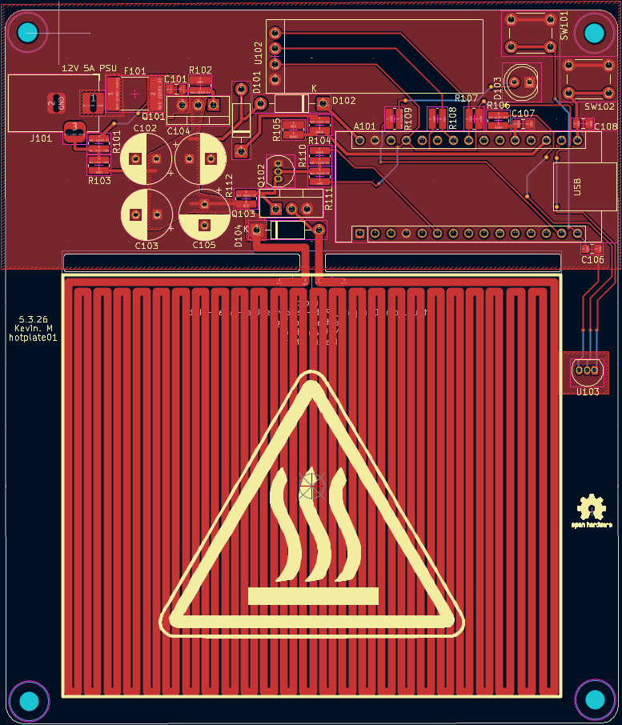
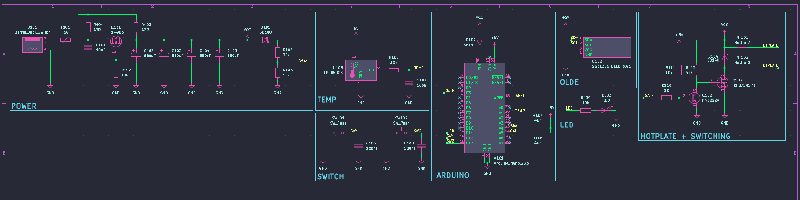
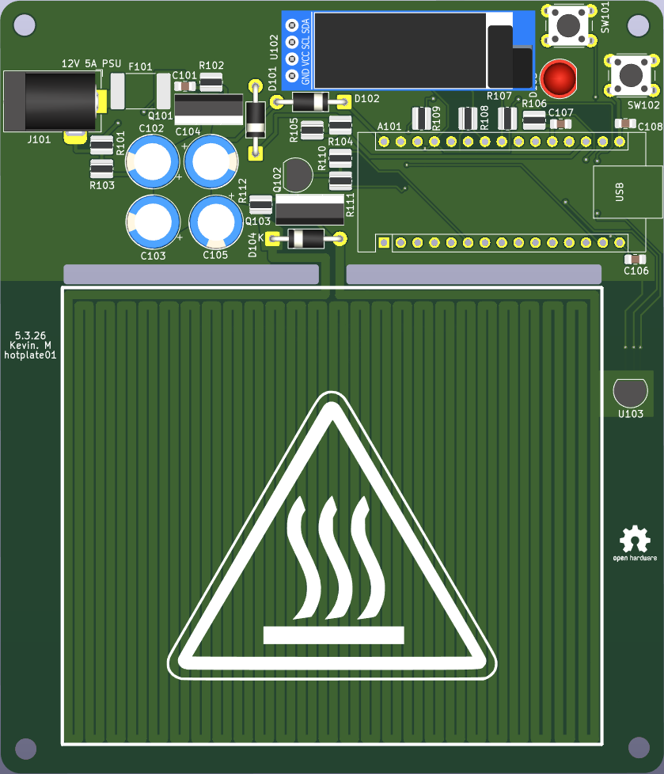

# PCB Hotplate Project (KiCad)
## PCB Layout:

## Schematic: 

## 3D Model:

## Overview

This project is a custom-designed PCB hotplate for reflow soldering, built around an Arduino Nano. The board reads real-time temperature via an analog LMT85 sensor and displays live readings on an I2C OLED screen, with two push-buttons for user control. Heating elements are switched using a low-side IRFB7545 power MOSFET, driven through a PN2222A transistor for proper gate-level switching, with Schottky diode protection and bulk capacitance across the power rail to maintain stability during high-current switching events. The design required balancing power delivery, thermal considerations, and signal integrity across analog sensing, digital control, and high-current switching sections on a single board.

## Objectives

Design schematic in KiCad

Create custom PCB layout

Handle higher current safely

Separate power and control sections

Apply proper trace width for heating load

## Tools Used

KiCad

ERC and DRC checks

PCB layout editor

3D viewer

## System Design

The board includes:

Power input section

Heating element output

Control circuit

Switching device (MOSFET or transistor)

Protection components

Power traces are wider to handle higher current.
Signal traces are separated to reduce noise.

## Design Considerations

Calculated trace width based on expected current

Added thermal relief on pads

Placed high current components close together

Kept control logic isolated from heating path

Used ground plane for stability

## Skills Demonstrated

Schematic capture

PCB layout design

Power electronics basics

Trace width calculation

Design rule verification

Component placement strategy

## What I Learned

Current affects trace width directly

Layout affects heat distribution

Component placement affects performance

ERC and DRC checks prevent costly mistakes

## Possible Improvements

Add temperature sensor feedback

Add PID temperature control
